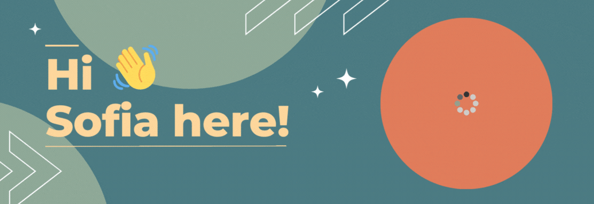

  

###

<h2 align="left">I'm a wannabe full stack JavaScript developer :sparkles:</h2>

###

📚 I'm currently learning MERN stack ([The Odin Project](https://www.theodinproject.com))  🎯 My main goal is to land my dream job as a developer in 2024 🛠️ I'm an aerospace engineer working as a project manager, videomaker and motion designer freelance 🍕 In my free time I read, run and make an insane amount of pizza 🌍 Based in Italy but willing to move to other European countries

###

<h2 align="left">I code with</h2>

###

###

<h2 align="left">My BFF are</h2>

###

###

<h2 align="left">Keep in touch</h2>

###

  

###

<h2 align="left">My stats</h2>

###

  
  

###

